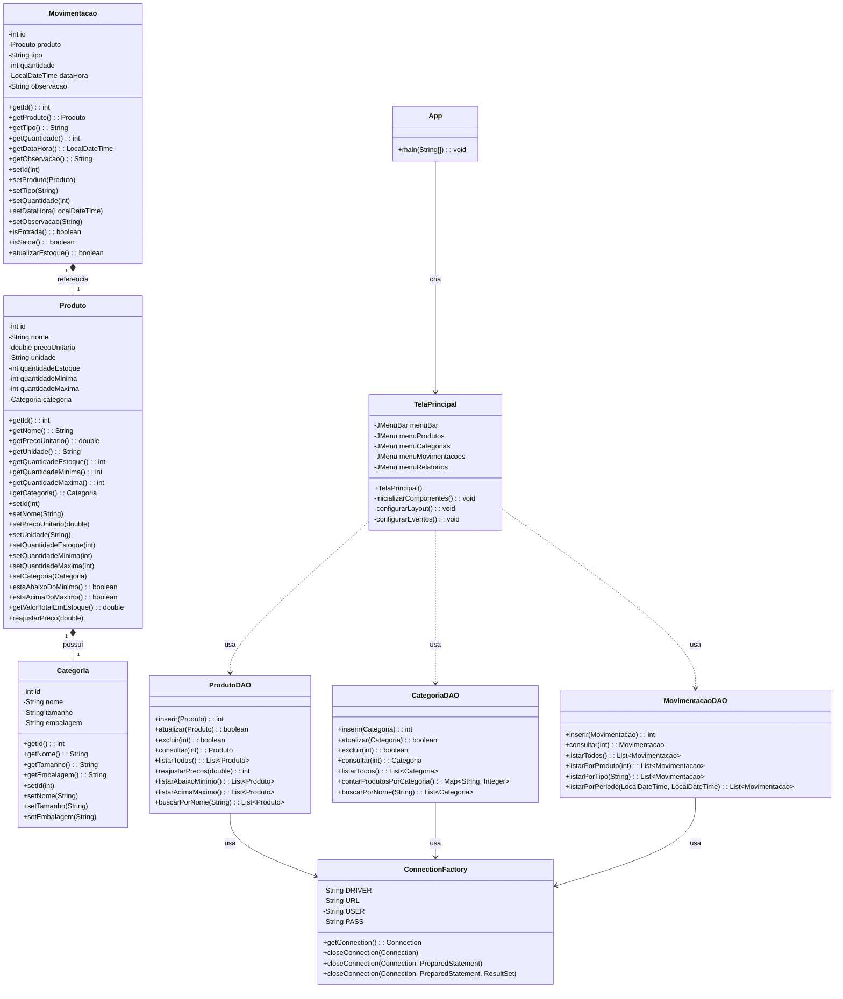

# Sistema de Controle de Estoque 📦

Projeto desenvolvido para a disciplina **Programação de Soluções Computacionais** da **Universidade do Sul de Santa Catarina - UNISUL**.

## 🎓 Informações Acadêmicas

- **Disciplina:** Programação de Soluções Computacionais
- **Professores:** Osmar de Oliveira Braz Júnior, Ricardo Ribeiro Assink
- **Avaliação:** A3 – Desempenho de compreensão
- **Meta:** Analisar uma situação-problema, interpretar e propor soluções utilizando linguagens e técnicas de programação.

## 👥 Integrantes do Grupo

- Arthur Zamprogna Ventura - 10725111773 - @arthurventuraza
- Gabriel Luipo - 1072519471 - @euluipo
- Nícolas Gaia Negrão - 1072517389 - @NickPotato
- Pedro Henrique Francio Della Giustina - 10725110773 - @PedroDella
- Thiago da Silveira Gentil - 1072112389 - @Tgentil

## 📝 Descrição do Projeto

Este sistema foi desenvolvido com base em um problema contextualizado do cotidiano: o gerenciamento de estoque de uma empresa comercial. O software permite:

- Cadastro, edição, consulta e exclusão de produtos; `(CRUD)`
- Classificação por categorias (ex: Limpeza, Alimentos, Bebidas);
- Controle de movimentações de entrada e saída de estoque;
- Relatórios para gestão e tomada de decisão.

Sistema inspirado no projeto modelo:  
🔗 [CadastroAlunoMySQLDAO - GitHub](https://github.com/osmarbraz/CadastroAlunoMySQLDAO)

## 🔐 Credenciais de Conexão Padrão (Mockup para Avaliação)

Para fins de avaliação e padronização entre os avaliadores, utilize as seguintes credenciais ao configurar sua conexão com o MySQL:

```java
Usuário: root  
Senha: teste123
```

## ✅ Requisitos Funcionais

### RF001 - Gerenciamento de Produtos
- **RF001.1:** Permitir o cadastro, consulta, edição e exclusão de produtos. (CRUD)
- **RF001.2:** Armazenar os seguintes atributos para cada produto: Nome, Preço unitário, Unidade de medida, Quantidade em estoque, Quantidade mínima, Quantidade máxima e Categoria associada.
- **RF001.3:** Permitir o reajuste de preços em massa para todos os produtos com base em um percentual informado.

### RF002 - Gerenciamento de Categorias
- **RF002.1:** Permitir o cadastro, consulta, edição e exclusão de categorias.
- **RF002.2:** Armazenar os seguintes atributos para cada categoria: Nome, Tamanho (Pequeno, Médio, Grande) e Embalagem (Lata, Vidro, Plástico).

### RF003 - Movimentação de Estoque
- **RF003.1:** Registrar entradas e saídas de produtos no estoque.
- **RF003.2:** Atualizar automaticamente a quantidade em estoque do produto após cada movimentação.
- **RF003.3:** Alertar o usuário durante a saída se a quantidade resultante ficar abaixo do mínimo definido para o produto.
- **RF003.4:** Alertar o usuário durante a entrada se a quantidade resultante ficar acima do máximo definido para o produto.

### RF004 - Geração de Relatórios
- **RF004.1:** Gerar relatório de Lista de Preços, contendo todos os produtos em ordem alfabética, com preço unitário, unidade de medida e categoria.
- **RF004.2:** Gerar relatório de Balanço Físico/Financeiro, listando todos os produtos em ordem alfabética, com quantidade disponível, valor total por produto (quantidade * preço unitário) e valor total do estoque (somatório dos valores totais).
- **RF004.3:** Gerar relatório de Produtos Abaixo da Quantidade Mínima, listando nome do produto, quantidade mínima e quantidade atual em estoque.
- **RF004.4:** Gerar relatório de Produtos Acima da Quantidade Máxima, listando nome do produto, quantidade máxima e quantidade atual em estoque.
- **RF004.5:** Gerar relatório de Quantidade de Produtos por Categoria, mostrando o nome da categoria e a quantidade de produtos distintos associados a ela.

## ⚠️ Requisitos Não Funcionais

- **RNF001 (Usabilidade):** A interface gráfica deve ser intuitiva e de fácil utilização.
- **RNF002 (Desempenho):** As consultas ao banco de dados e a geração de relatórios devem ser realizadas em tempo hábil.
- **RNF003 (Manutenibilidade):** O código deve seguir boas práticas (Clean Code), ser bem documentado e organizado em pacotes (model, view, dao, util) para facilitar a manutenção e futuras evoluções.
- **RNF004 (Portabilidade):** O sistema deve ser executável em diferentes sistemas operacionais que suportem Java e MySQL.
- **RNF005 (Segurança):** As credenciais de acesso ao banco de dados não devem ser expostas diretamente no código versionado (idealmente, usar variáveis de ambiente ou arquivos de configuração externos, **mas para este projeto acadêmico** , estão em `ConnectionFactory.java` e devem ser ajustadas localmente).
- **RNF006 (Tecnologia):** O sistema deve ser desenvolvido utilizando as tecnologias especificadas (Java, MySQL, Swing, DAO).

## 🛠️ Tecnologias e Ferramentas Utilizadas

- **Linguagem:** Java (JDK 11)
- **IDE:** IntelliJ IDEA (Recomendado, versão 2023.x ou superior) / NetBeans
- **Banco de Dados:** MySQL Server (Recomendado, versão 8.0 ou superior)
- **Driver Banco de Dados:** MySQL Connector/J (JDBC Driver, versão 8.0.x ou superior)
- **Interface Gráfica:** Java Swing
- **Padrão de Acesso a Dados:** DAO (Data Access Object)
- **Controle de Versão:** Git (Recomendado, versão 2.x ou superior) + GitHub
- **Gerenciamento de Dependência**: Maven, versão 3.9.9

## 🧱 Estrutura do Projeto

- `src/main/java/model`: Classes de entidade (Produto, Categoria, Movimentacao)
- `src/main/java/view`: Telas e interface gráfica (Swing)
- `src/main/java/dao`: Classes de persistência e consultas ao banco
- `src/main/java/util`: Classes utilitárias (Validador, GeradorRelatorio)
- `db/estoque.sql`: Script SQL para criação do banco de dados

## 📂 Banco de Dados

Arquivo `db/estoque.sql` contendo:

- Criação das tabelas `produto`, `categoria`, `movimentacao`
- Relações entre produto e categoria
- Restrições e tipos adequados
- Dados de exemplo para testes

## 📊 Relatórios Gerados

- `Relatório de Preços`
- `Balanço Físico/Financeiro`
- `Produtos Abaixo do Mínimo`
- `Produtos Acima do Máximo`
- `Total por Categoria`

## 📌 Observações Finais

- O projeto foi desenvolvido colaborativamente com versionamento no GitHub.
- As mensagens de commit seguem convenções claras.
- O código foi padronizado conforme boas práticas de organização e legibilidade.

## 📁 Como Executar o Projeto

### Pré-requisitos

- Java JDK 11
- IDE Java (IntelliJ IDEA recomendado)
- MySQL Server instalado e em execução
- Maven 3.9.9

### Passo a Passo

1. **Clone o repositório:**
   ```bash
   git clone https://github.com/PedroDella/SistemasControleEstoque
   ```

2. **Configure o banco de dados:**
- Certifique-se de que o MySQL Server esteja instalado e em execução
- Abra o MySQL Command Line Client ou MySQL Workbench
- Crie o banco de dados e execute o script SQL:
  ```sql
  CREATE DATABASE controle_estoque;
  USE controle_estoque;
  source caminho/para/db/estoque.sql
  ```
- Alternativamente, no MySQL Workbench, vá em File > Open SQL Script, selecione o arquivo `db/estoque.sql` e execute-o

3. **Configure a conexão com o banco de dados:**
- Abra o arquivo `src/main/java/dao/ConnectionFactory.java`
- Ajuste as constantes de conexão conforme sua configuração:
  ```java
  private static final String DRIVER = "com.mysql.cj.jdbc.Driver";
  private static final String URL = "jdbc:mysql://localhost:3306/controle_estoque";
  private static final String USER = "root"; // Altere para seu usuário MySQL
  private static final String PASS = "teste123";   // Altere para sua senha MySQL
  ```

4. **Importe o projeto na sua IDE:**
- No IntelliJ IDEA: File > Open > Selecione a pasta do projeto

5. **Execute a aplicação:**
- Navegue até a classe `src/main/java/view/App.java`
- Clique com o botão direito e selecione "Run 'App.main()'"
- A interface gráfica do sistema será iniciada

### Solução de Problemas

- Se ocorrer erro de conexão com o banco de dados:
    - Verifique se o MySQL está em execução
    - Confirme se as credenciais em ConnectionFactory.java estão corretas
    - Certifique-se de que o banco de dados `controle_estoque` foi criado

- Se ocorrer erro de ClassNotFoundException:
    - Verifique se o driver JDBC do MySQL foi adicionado corretamente ao projeto

### Estruturação do Projeto

[Estrutura do Projeto - Sistema de Controle de Estoque](docs/Estrutura_do_Projeto.md)


### Diagrama de Classes


